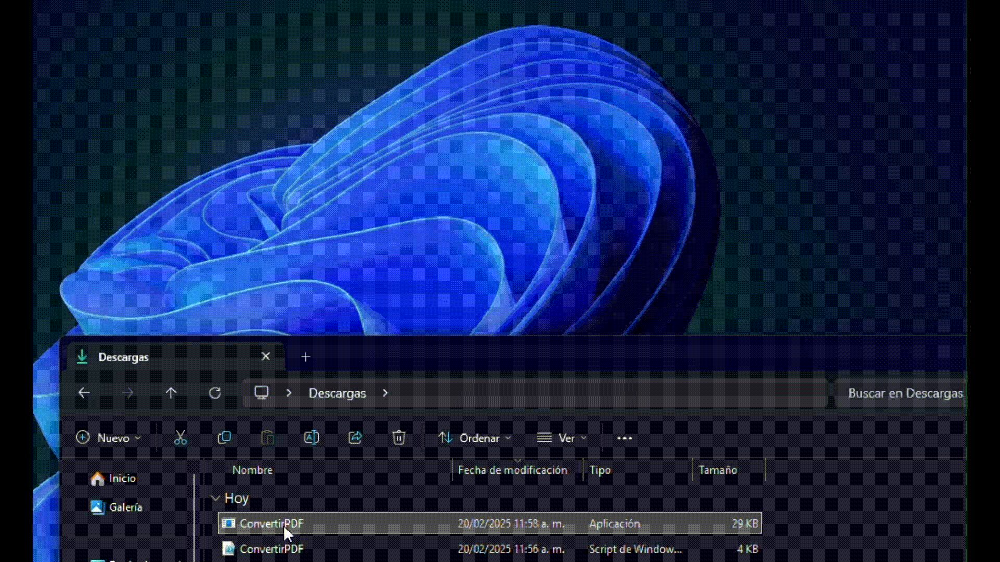

# 📄 Office to PDF Converter | Convertidor Office a PDF

<div align="center">


[](https://www.linkedin.com/in/nicolas-vargas-956b79166/)

[🇺🇸 English](README.en.md) | [🇪🇸 Español](README.md)

</div>

## 📝 Descripción

Potente script en PowerShell que automatiza la conversión de documentos de Microsoft Office a PDF. Procesa archivos de Word y Excel de forma recursiva en carpetas, ofreciendo una interfaz gráfica intuitiva y barras de progreso en tiempo real.

## ✨ Características

- 🖥️ **Interfaz Gráfica**: Selector de carpetas y notificaciones usando `System.Windows.Forms`
- 📊 **Múltiples Formatos**: Soporta `.doc`, `.docx`, `.xls`, `.xlsx`, `.xlsm`
- 📈 **Barra de Progreso**: Visualización en tiempo real del proceso de conversión
- 🔔 **Notificaciones**: Alertas informativas al completar las conversiones
- 🛠️ **Personalizable**: Código limpio y documentado para fácil adaptación

## 🚀 Inicio Rápido

### Prerrequisitos

- ✅ Microsoft Office (Word y Excel) instalado
- ✅ PowerShell 5.1 o superior
- ✅ Permisos de ejecución configurados

### 🔧 Instalación

1. **Clonar el repositorio**
   ```powershell
   git clone https://github.com/nicolasvar18/-Convertidor-a-PDF.git
   cd -Convertidor-a-PDF
   ```

2. **Configurar permisos de ejecución**
   ```powershell
   Set-ExecutionPolicy RemoteSigned -Scope CurrentUser
   ```

3. **Ejecutar el script**
   ```powershell
   .\ConvertirPDF.ps1
   ```

### 📦 Crear Ejecutable (Opcional)

```powershell
# Instalar PS2EXE
Install-Module -Name PS2EXE -Scope CurrentUser

# Convertir a ejecutable
Invoke-ps2exe .\ConvertirPDF.ps1 .\ConvertirPDF.exe
```

## 📸 Demostración

<div align="center">
  
</div>

## 🤝 Contribuciones

Las contribuciones son bienvenidas. Para cambios importantes:

1. 🍴 Fork del repositorio
2. 🔧 Crea tu rama (`git checkout -b feature/AmazingFeature`)
3. 💾 Commit a tus cambios (`git commit -m 'Add: AmazingFeature'`)
4. 📤 Push a tu rama (`git push origin feature/AmazingFeature`)
5. 📩 Abre un Pull Request

## 📄 Licencia

Este proyecto está bajo la Licencia MIT - ver el archivo [LICENSE](LICENSE) para más detalles.

## 👤 Autor

Nicolás Vargas
- 🌐 [Website](https://nicolasvargas.dev)
- 💼 [LinkedIn](https://www.linkedin.com/in/nicolas-vargas-956b79166/)

## 🙏 Agradecimientos

- Microsoft Office COM Objects Documentation
- PowerShell Community
- Todos los contribuidores

---

<div align="center">
⭐ Si este proyecto te ayudó, ¡no dudes en darle una estrella!
</div>